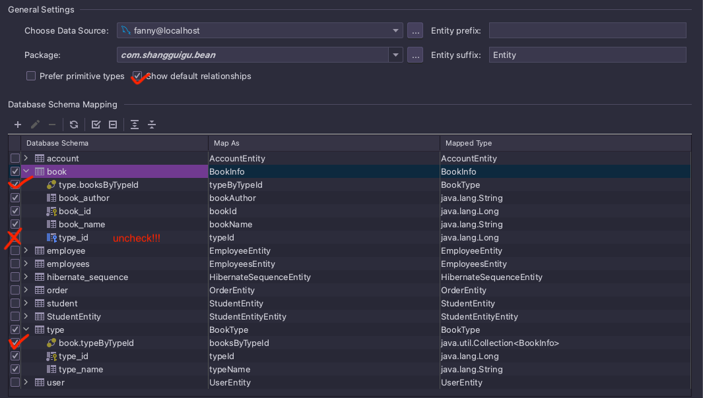
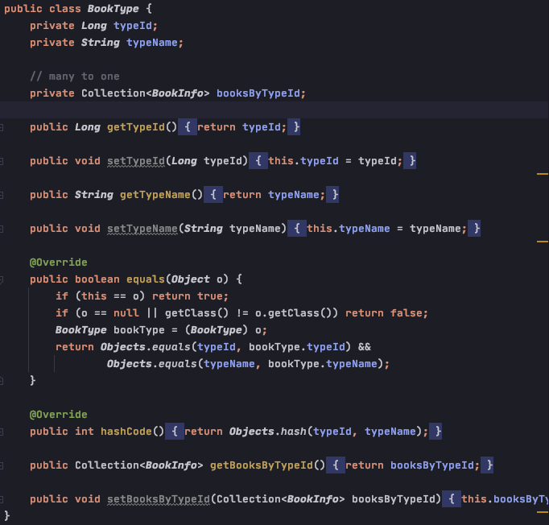
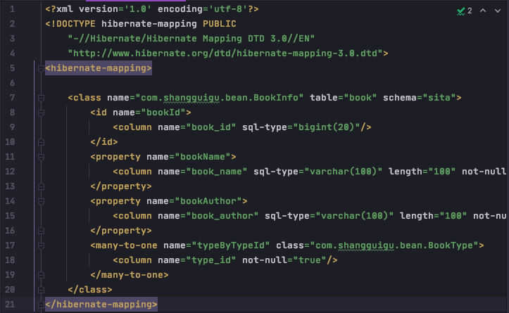
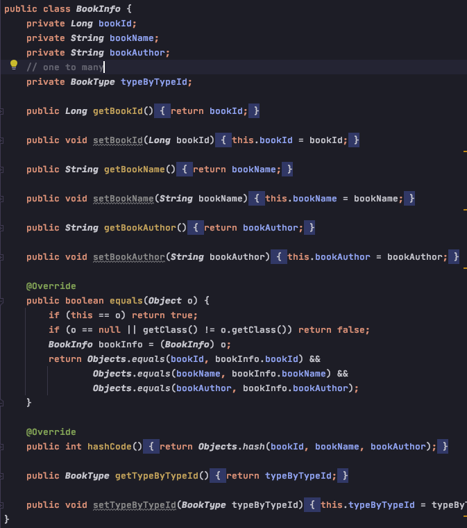
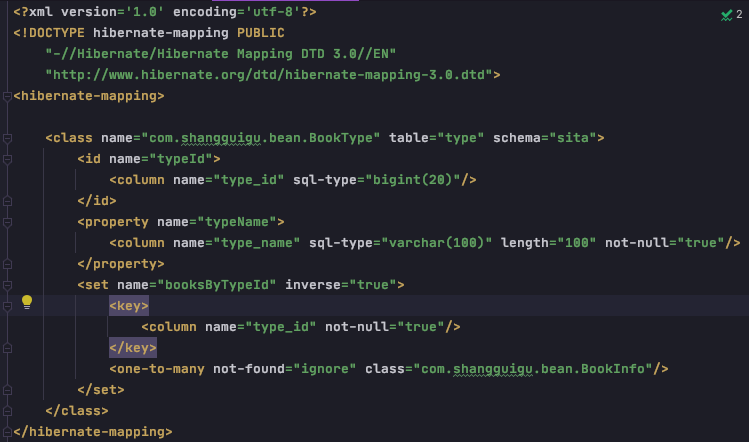
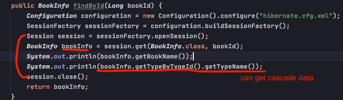
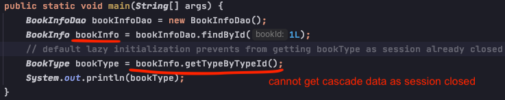
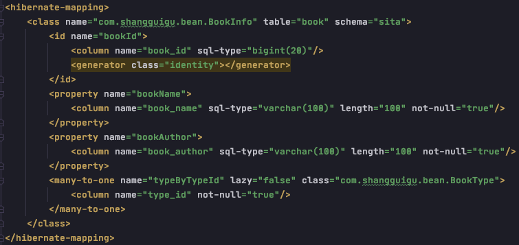
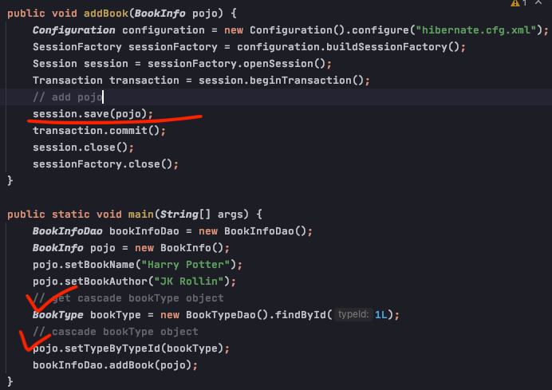
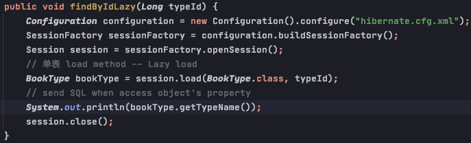

# Hibernate

1. 全自动持久层框架

2. ORM 映射关系

        1) table -- class
        2) row -- object
        3) column -- attribute
        

3. 创建Hibernate配置文件
    
        1) 创建核心配置文件
       
       Step1: 从 org.hibernate:hibernate-core:version_#/org.hibernate 中定位 .dtd 配置文件

       
      Step2: 创建xml file template, 将配置文件的命名空间头粘贴到template中

      Step3: 配置参数

           

           
      2) 创建映射文件 (注册到核心配置文件)
      
      Step1: 修改pom.xml文件，使得idea可以编译java目录中的.xml文件

      Step2: add hibernate-mapping.xml

        - Directory structure:

        - Mapping File content (with data-source attached):

            
        - Add Java object to hibernate.cfg config file:

        

4. 数据库操作步骤

添加一条数据 (7 steps)

5. Hibernate reverse engineer -- 根据数据表生成映射文件和实体类

        - 需要手动添加 id gernerator strategy 

6. HQL - Hibernate Query Language

        - 1) Find All

       - 2) Find By Pagination

       - 3) Conditional Query By Index

       
       - 4) Conditional Query By Name

7. 支持事务下的本地线程绑定

        - sessionFactory.getCurrentSession() --> 多线程安全, 多线程环境下传递session, 但必须开启事务，哪怕是查询操作
        - sessionFactory.openSession() --> 多线程不安全
        
配置

对比 getCurrentSession() 和 openSession(), 同线程中开启的getCurrentSession() 是相同的

8. 级联操作 (一对多/ 多对一) -- (book -> bookType)

        step1: reverse-engineer from db to create Java class & mapping config file
            

       step2: Java class & mapping config file
           
bookInfo: 

bookInfo-mapping:

bookType:

bookType-mapping:

        step3: 测试
            a. 常用的级联操作: 
                1) 级联查询 (One-to-Many, Many-to-One)
                默认lazy="true"：关联表的信息默认是延迟检索的，session关闭后无法访问级联表的属性

         
                    设置级联表立即检索, 检索后即使session关闭后，也可以继续访问级联表的属性

            b. 建议各自表单进行的操作
                1) 添加操作 (尤其指在Many一方添加数据，设置One方数据时需要从One方先获取 或 先创建，再添加)

                        
                2) 更新操作

            c. 不建议的操作 error-prone and dangerous!!!
                1) 级联更新
                2) 级联删除

9. 检索方式
    
        - 立即检索 (执行完查询语句后，立即查询数据库)
        单表get()方法查询

        - 延迟检索 (执行完查询语句后，在需要时才查数据库，也叫懒加载)
        单表load()方法查询

