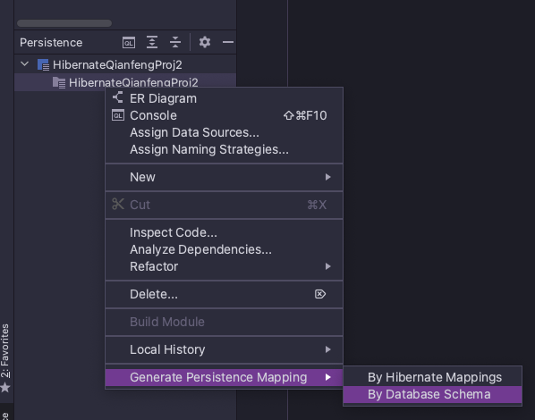

# Hibernate

1. 全自动持久层框架

2. ORM 映射关系

        1) table -- class
        2) row -- object
        3) column -- attribute
        

3. 创建Hibernate配置文件
    
        1) 创建核心配置文件
       
       Step1: 从 org.hibernate:hibernate-core:version_#/org.hibernate 中定位 .dtd 配置文件

       
      Step2: 创建xml file template, 将配置文件的命名空间头粘贴到template中

      Step3: 配置参数

           

           
      2) 创建映射文件 (注册到核心配置文件)
      
      Step1: 修改pom.xml文件，使得idea可以编译java目录中的.xml文件

      Step2: add hibernate-mapping.xml

        - Directory structure:

        - Mapping File content (with data-source attached):

            
        - Add Java object to hibernate.cfg config file:

        

4. 数据库操作步骤

添加一条数据 (7 steps)

5. Hibernate reverse engineer -- 根据数据表生成映射文件和实体类

        - 需要手动添加 id gernerator strategy 

